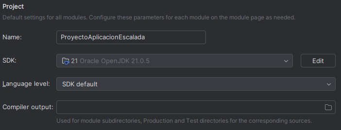
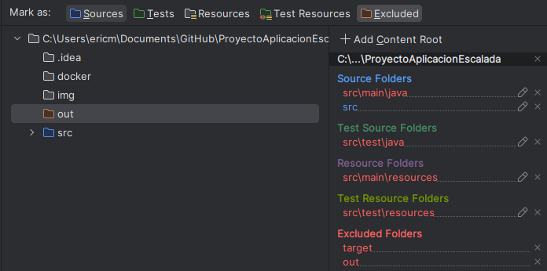

# Proyecto Aplicación Escalada

Proyecto creando una aplicación de escalada usando MySQL y JAVA con la API de JDBC - Eric Mejias y David Catalan

## 📋 Requisitos

Antes de comenzar, asegúrate de contar con lo siguiente:

- **Java JDK 21 o superior**

   - Para poder usar el proyecto es totalmente obligatorio instalar JDK 21 o superior y es basicamente para poder ejecutar codigo en Java.

   - Para obtener JDK 21 podemos [descargar JDK 21](https://www.oracle.com/java/technologies/javase/jdk21-archive-downloads.html) con las opciones por defecto en el enlace.

- **Docker Desktop**

   - Usaremos docker para crear un container y tener ahi nuestra base de datos y poder usar nuestra aplicacion sin problema.

   - Para obtener [Docker Desktop](https://www.docker.com/products/docker-desktop/) sera tan sencillo como descargar docker y dejar las opciones por defecto.

- **Maven (no necesario si se usa IntelliJ)**

   - Maven lo usaremos para obtener todas las dependencias que necesitamos en el proyecto para que todo funcione perfectamente.

   - Si no tienes IntelliJ y prefieres usar línea de comandos, instala Maven siguiendo la [guía oficial](https://maven.apache.org/install.html).

> [!Note]
>
> Si trabajas desde un IDE como IntelliJ, no es obligatorio instalar Maven por separado, ya que el IDE gestionará las dependencias automáticamente.

- **IntelliJ (opcional pero recomendable)**

   - Podemos [obtener IntelliJ](https://www.jetbrains.com/es-es/idea/download/?section=windows) para poder usar nuestra aplicacion de escalada y hacer nuestro propio compilado del proyecto.

## 🚀 Clonar el repositorio

Una vez tengamos el JDK 21, el Docker Desktop y en caso de usar IntelliJ o instalar Maven.

```bash
git clone https://github.com/Eriquito00/ProyectoAplicacionEscalada.git

cd ProyectoAplicacionEscalada
```

## 🗄️ Arranque de la base de datos

Ahora que ya tienes todo instalado comprueba en el IDE que las dependencias estan instaladas correctamente, si no las tienes instaladas prueba a eliminar la carpeta del proyecto y volver a clonar el repositorio.

1. Asegúrate de tener Docker Desktop instalado y abierto.
2. Desde la raíz del proyecto abre una terminal, puede ser CMD, PowerShell o la terminal de tu sistema operativo y ejecuta lo siguiente:

```bash
docker-compose up -d
```

3. Esto levantará el contenedor de MySQL (**mysql_escalada**) si hemos hecho todos los pasos anteriores correctamente.
4. La bbdd ya tiene datos por defecto, pero, si quieres reinicializar el contenedor y que se vuelvan a ejecutar los scripts de inicio, entonces debes ejecutar:
   
```bash
docker-compose down -v
```

Una vez has eliminado los volumenes del contenedor, ejecuta:

```bash
docker-compose up --build
```

Asi podras reinicializar el contenedor

## 🖥️ Uso

Al iniciar verás un menú de consola con opciones para:

1. **Crear**
2. **Actualizar**
3. **Borrar**
4. **Consultar**
5. **Consultas Avanzadas**

## 🛠️ Configuración recomendada IntelliJ

Es recomendable usar y comprobar que estas configuraciones estan asi en nuestro proyecto para poder editar, usar y compilar el proyecto sin problemas, poder usar el JDK, la carpeta de source, out...

- **JDK**

   - Par configurar el JDK iremos a la estructura del proyecto y pondremos como JDK el que hemos descargado y como Language Level el que coja por defecto el SDK tal y como se ve en la configuracion siguiente:



- **Source y Out**

   - Es importante configurar las carpetas de source, que es donde estan todos los archivos .java y out que es donde estaran las builds de nuestro proyecto una vez compilemos, una vez hecho esto podemos usar la aplicacion sin problemas.



Porfavor, comprueba que Maven se ha traido las dependencias a el proyecto, si no, prueba a volver a clonar el proyecto!


## 🤝 Contribuciones

Si crees que puedes mejorar la aplicacion y añadir alguna funcionabilidad interesante puedes hacer un fork del repositorio en github y hacernos una pull request.

## 📄 Licencia

Este proyecto está bajo la licencia [MIT](./LICENSE).

###### BY: **[Eriquito00](https://github.com/Eriquito00)** and **[Wysper](https://github.com/WysperOtaku)**
